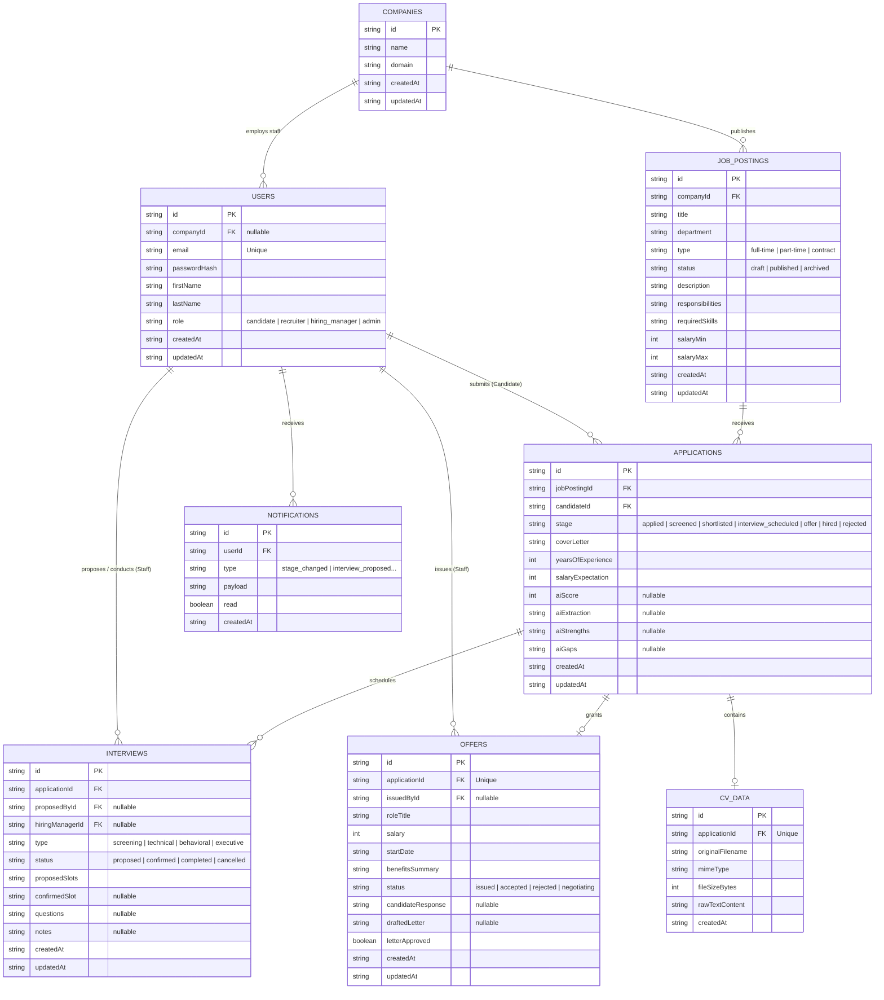

# ShortList — Entity Relationship (ER) Diagram

This document contains the relational database schema diagram and entity specifications for the ShortList recruitment platform.

```mermaid
erDiagram
    COMPANIES ||--o{ USERS : "employs staff"
    COMPANIES ||--o{ JOB_POSTINGS : "publishes"
    USERS ||--o{ APPLICATIONS : "submits (Candidate)"
    USERS ||--o{ INTERVIEWS : "proposes / conducts (Staff)"
    USERS ||--o{ OFFERS : "issues (Staff)"
    USERS ||--o{ NOTIFICATIONS : "receives"
    JOB_POSTINGS ||--o{ APPLICATIONS : "receives"
    APPLICATIONS ||--o{ INTERVIEWS : "schedules"
    APPLICATIONS ||--o| OFFERS : "grants"
    APPLICATIONS ||--o| CV_DATA : "contains"

    COMPANIES {
        string id PK
        string name
        string domain
        string createdAt
        string updatedAt
    }

    USERS {
        string id PK
        string companyId FK "nullable"
        string email "Unique"
        string passwordHash
        string firstName
        string lastName
        string role "candidate | recruiter | hiring_manager | admin"
        string createdAt
        string updatedAt
    }

    JOB_POSTINGS {
        string id PK
        string companyId FK
        string title
        string department
        string type "full-time | part-time | contract"
        string status "draft | published | archived"
        string description
        string responsibilities
        string requiredSkills
        int salaryMin
        int salaryMax
        string createdAt
        string updatedAt
    }

    APPLICATIONS {
        string id PK
        string jobPostingId FK
        string candidateId FK
        string stage "applied | screened | shortlisted | interview_scheduled | offer | hired | rejected"
        string coverLetter
        int yearsOfExperience
        int salaryExpectation
        int aiScore "nullable"
        string aiExtraction "nullable"
        string aiStrengths "nullable"
        string aiGaps "nullable"
        string createdAt
        string updatedAt
    }

    CV_DATA {
        string id PK
        string applicationId FK "Unique"
        string originalFilename
        string mimeType
        int fileSizeBytes
        string rawTextContent
        string createdAt
    }

    INTERVIEWS {
        string id PK
        string applicationId FK
        string proposedById FK "nullable"
        string hiringManagerId FK "nullable"
        string type "screening | technical | behavioral | executive"
        string status "proposed | confirmed | completed | cancelled"
        string proposedSlots
        string confirmedSlot "nullable"
        string questions "nullable"
        string notes "nullable"
        string createdAt
        string updatedAt
    }

    OFFERS {
        string id PK
        string applicationId FK "Unique"
        string issuedById FK "nullable"
        string roleTitle
        int salary
        string startDate
        string benefitsSummary
        string status "issued | accepted | rejected | negotiating"
        string candidateResponse "nullable"
        string draftedLetter "nullable"
        boolean letterApproved
        string createdAt
        string updatedAt
    }

    NOTIFICATIONS {
        string id PK
        string userId FK
        string type "stage_changed | interview_proposed..."
        string payload
        boolean read
        string createdAt
    }
```
